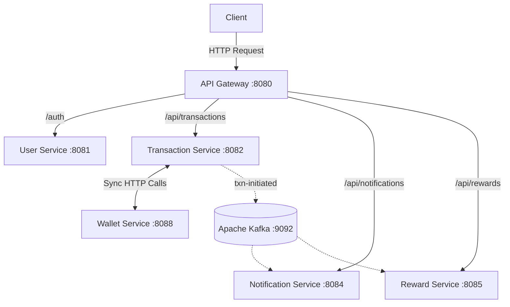
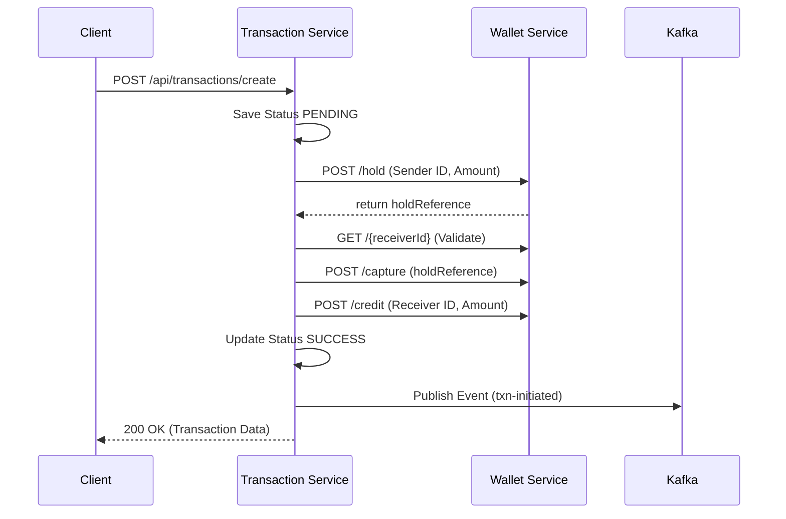

# PayPal Backend Project Documentation

## 1. Project Overview

### Purpose of the Project
The PayPal Backend Project is a microservices-based financial transaction system that mimics the core functionalities of a payment gateway like PayPal. It provides a robust, scalable architecture to handle user authentication, digital wallet management, secure fund transfers, automated reward distributions, and real-time transaction notifications.

### Business Problem Being Solved
Monolithic payment architectures often suffer from tight coupling, making them hard to scale and maintain. This project solves the problem by decoupling distinct domains (users, wallets, transactions, notifications, rewards) into independent microservices. This ensures that failures in auxiliary systems (like notifications) do not disrupt core financial workflows (like fund transfers), and it allows independent scaling of high-traffic services.

### High-level Architecture
The system employs an event-driven microservices architecture:
*   **API Gateway**: Acts as the single entry point, routing requests and enforcing rate limiting.
*   **Core Microservices**: Independent services managing specific business domains.
*   **Synchronous Communication**: RESTful HTTP calls are used for strict transactional workflows (e.g., Transaction Service coordinating with Wallet Service).
*   **Asynchronous Communication**: Apache Kafka is used for eventual consistency and decoupled event processing (e.g., sending notifications and calculating rewards after a successful transaction).

### Key Features
*   **Secure Authentication**: JWT-based user authentication and role management.
*   **Wallet Management**: Digital wallets supporting holds, captures, credits, and debits to ensure data integrity during concurrent transactions.
*   **Transactional Integrity**: Orchestrated fund transfers with a multi-step hold-and-capture process to prevent race conditions and overdrafts.
*   **Event-Driven Processing**: Automated and decoupled reward point allocation and notification generation using Kafka.
*   **Traffic Control**: Redis-backed API rate limiting.

---

## 2. Technology Stack

*   **Java Version**: Java 21
*   **Framework**: Spring Boot 3.2.5
*   **Build Tool**: Maven (with `spring-boot-maven-plugin`)
*   **Databases**: PostgreSQL (Database-per-Service architecture)
*   **Message Broker**: Apache Kafka (with Zookeeper via Confluent Docker images, version 7.4.1)
*   **API Gateway**: Spring Cloud Gateway
*   **Caching/Rate Limiting**: Redis (Localhost, port 6379)
*   **REST APIs**: Spring Web (Tomcat embedded)
*   **Security Framework**: Spring Security with JWT (JSON Web Tokens)
*   **ORM**: Hibernate / Spring Data JPA
*   **JSON Processing**: Jackson (with `JavaTimeModule` for date/time)

---

## 3. System Architecture

### Microservices Involved
1.  **API Gateway Service** (`port: 8080`): Routes incoming traffic to appropriate downstream services.
2.  **User Service** (`port: 8081`): Manages user identity, registration, and JWT token issuance.
3.  **Transaction Service** (`port: 8082`): Orchestrates financial transactions and publishes events to Kafka.
4.  **Notification Service** (`port: 8084`): Consumes transaction events and persists user notifications.
5.  **Reward Service** (`port: 8085`): Consumes transaction events and allocates reward points to users.
6.  **Wallet Service** (`port: 8088`): Manages financial ledgers, wallet balances, and fund hold/release mechanisms.

### Request Flow
1.  A client request arrives at the **API Gateway**.
2.  The gateway checks the `Predicates` (e.g., `/auth/**` goes to User Service).
3.  If rate limiting is enabled (e.g., for transactions, rewards, notifications), the Redis `RequestRateLimiter` evaluates the request.
4.  The request is forwarded to the corresponding microservice controller.

### Event Flow
1.  **Transaction Service** successfully completes a fund transfer.
2.  It uses `KafkaEventProducer` to publish a `Transaction` payload to the `txn-initiated` topic.
3.  **NotificationConsumer** and **RewardConsumer** asynchronously read the message.
4.  They independently process the payload (saving a notification and allocating points) without blocking the core transaction.

---

## 4. Database Documentation

The project uses the Database-per-Service architecture with independent PostgreSQL databases for each service, initialized via Docker Compose.

### User Service (`app_user` table)
*   **id**: `Long` (PK, Auto-increment)
*   **name**: `String`
*   **email**: `String` (Unique constraint)
*   **password**: `String` (BCrypt encoded)
*   **role**: `String` (e.g., "ROLE_USER")

### Wallet Service (`wallets` and `transactions` tables)
**Wallet Entity (`wallets`)**
*   **id**: `Long` (PK, Auto-increment)
*   **userId**: `Long` (Unique constraint)
*   **currency**: `String` (Length 3, default "INR")
*   **balance**: `Long` (Total balance)
*   **availableBalance**: `Long` (Balance minus active holds)
*   **createdAt**, **updatedAt**: `LocalDateTime`

**Transaction Entity (`transactions` - Ledger)**
*   **id**: `Long` (PK, Auto-increment)
*   **wallet_id**: `Long` (FK to wallets)
*   **type**: `Enum(TransactionType)`
*   **amount**: `Long`
*   **status**: `Enum(TransactionStatus)`
*   **referenceId**: `String`

### Transaction Service (`transaction` table)
*   **id**: `Long` (PK, Auto-increment)
*   **senderId**: `Long`
*   **receiverId**: `Long`
*   **amount**: `Double` (Constraint: Positive)
*   **timestamp**: `LocalDateTime`
*   **status**: `String` (PENDING, SUCCESS, FAILED)

### Reward Service (`Reward` table)
*   **id**: `Long` (PK, Auto-increment)
*   **userId**: `Long`
*   **points**: `Double`
*   **sentAt**: `LocalDateTime`
*   **transactionId**: `Long`

### Notification Service (`Notification` table)
*   **id**: `Long` (PK, Auto-increment)
*   **userId**: `Long`
*   **message**: `String`
*   **sentAt**: `LocalDateTime`

---

## 5. API Documentation

### User Service
*   **POST /auth/signup**
    *   *Purpose*: Register a new user.
    *   *Body*: `SignupRequest(name, email, password)`
    *   *Response*: `AuthResponse(message, userId, token)`
*   **POST /auth/login**
    *   *Purpose*: Authenticate and receive a JWT.
    *   *Body*: `LoginRequest(email, password)`
    *   *Response*: `AuthResponse(message, userId, token)`
*   **GET /api/users/all**
    *   *Purpose*: Retrieve all users.

### Transaction Service
*   **POST /api/transactions/create**
    *   *Purpose*: Initiate a fund transfer.
    *   *Body*: `Transaction(senderId, receiverId, amount)`
    *   *Response*: Saved `Transaction` object (with status SUCCESS or FAILED).
*   **GET /api/transactions/all**
    *   *Purpose*: View all transaction histories.

### Wallet Service
*   **POST /api/v1/wallets/create**
    *   *Purpose*: Create a wallet for a user.
    *   *Body*: `CreateWalletRequest`
*   **POST /api/v1/wallets/hold**
    *   *Purpose*: Place a hold on funds (Phase 1 of transfer).
*   **POST /api/v1/wallets/capture**
    *   *Purpose*: Capture held funds (Phase 2 of transfer).
*   **POST /api/v1/wallets/credit**
    *   *Purpose*: Credit funds to a wallet.
*   **POST /api/v1/wallets/debit**
    *   *Purpose*: Directly debit funds.

### Reward Service
*   **GET /api/rewards**
    *   *Purpose*: Retrieve all allocated rewards.
*   **GET /api/rewards/user/{userId}**
    *   *Purpose*: Get rewards for a specific user.

---

## 6. Authentication & Security

*   **Authentication Flow**: Users register via `/auth/signup`. Upon providing credentials to `/auth/login`, the `UserService` verifies the bcrypt-encoded password and issues a JWT token.
*   **JWT Details**: Tokens are generated using the `my-super-secret-key-that-you-never-share` secret defined in `application.yml`.
*   **Authorization Flow**: The system uses a `JWTrequestFilter` to intercept incoming API calls, extract the Bearer token, validate the signature, and set the user's `Authentication` context within Spring Security.
*   **Roles**: Newly registered users default to `ROLE_USER`.

---

## 7. Kafka/Event-Driven Architecture

The project leverages Kafka to handle post-transaction workflows asynchronously.

*   **Topic**: `txn-initiated`
*   **Producers**: `KafkaEventProducer` in the Transaction Service. Publishes the serialized `Transaction` entity upon successful fund capture and credit.
*   **Consumers**:
    *   `NotificationConsumer` (Group: `notification-group`): Reads the transaction, extracts the `senderId` and `amount`, and saves a formatted `Notification` entity.
    *   `RewardConsumer` (Group: `reward-group`): Reads the transaction, verifies if a reward for the `transactionId` already exists, and if not, calculates points (`amount * 100`) and saves the `Reward` entity.
*   **Serialization**: Uses standard `StringSerializer` for keys and Spring's `JsonSerializer`/`JsonDeserializer` (with `JavaTimeModule`) for values.

---

## 8. Business Workflows

### Transaction Flow
1.  **Request**: Gateway routes `POST /api/transactions/create` to Transaction Service.
2.  **Initialize**: `TransactionServiceImpl` saves a `PENDING` transaction.
3.  **Place Hold**: Transaction Service makes a synchronous HTTP call to `Wallet Service` (`/hold`) to reserve `amount` from `senderId`. Returns a `holdReference`.
4.  **Validate Receiver**: Makes an HTTP call to verify `receiverId` wallet exists.
5.  **Capture**: Makes an HTTP call to `Wallet Service` (`/capture`) using the `holdReference` to finalize the deduction.
6.  **Credit**: Makes an HTTP call to `Wallet Service` (`/credit`) to add funds to `receiverId`.
7.  **Finalize**: Updates transaction status to `SUCCESS` and saves to DB.
8.  **Event Generation**: Pushes the transaction to the `txn-initiated` Kafka topic.

### User Flow
1.  **Registration**: User calls `/auth/signup`. Service ensures email is unique, hashes password, and saves `User` entity.
2.  **Login**: User calls `/auth/login`. Service validates hash against DB, generates a JWT using `JWTUtil`, and returns it.
3.  **Access**: Subsequent requests must include the JWT in the Authorization header.

---

## 9. Code Structure Documentation

Standardized across microservices:
*   `controller`: Exposes REST endpoints (`@RestController`).
*   `service`: Contains business logic and interfaces (e.g., `TransactionServiceImpl`).
*   `repository`: Spring Data JPA interfaces extending `JpaRepository`.
*   `entity`: JPA mapped domain models (`@Entity`).
*   `dto`: Data Transfer Objects for request/response bodies.
*   `config`: Configuration classes for Security, Kafka, Jackson, etc.
*   `kafka`: Contains `KafkaEventProducer` and `@KafkaListener` consumers.
*   `exception`: Custom exceptions and `@ControllerAdvice` global handlers.

---

## 10. Configuration Documentation

Found in `application.yml` and `application.properties`:
*   **Databases**: Uses independent PostgreSQL databases (e.g., `paypal_user`, `paypal_wallet`). `ddl-auto: update` is used to auto-generate schemas.
*   **Kafka**: `bootstrap-servers: localhost:9092`. Uses `JsonDeserializer` configured with trusted packages to map incoming JSON to local entities.
*   **API Gateway**: Defines `routes` and `predicates`. Implements `RequestRateLimiter` using Redis (Replenish Rate: 10, Burst Capacity: 20).
*   **Ports**: 
    * Gateway: 8080
    * User: 8081
    * Transaction: 8082
    * Notification: 8084
    * Reward: 8085
    * Wallet: 8088

---

## 11. Deployment Guide

### Prerequisites
*   Java 21 installed.
*   Maven installed.
*   Docker and Docker Compose installed.

### Build Process
Navigate to the root directory and build the parent POM or navigate to individual services:
```bash
mvn clean install
```

### Running the Infrastructure (Docker)
The project relies on Zookeeper, Kafka, and PostgreSQL. A `docker-compose.yml` is provided at the root:
```bash
docker-compose up -d
```
This will initialize Kafka, Zookeeper, and a PostgreSQL instance containing all 5 necessary databases.
*Note: Redis must also be running locally on port 6379 for the API Gateway rate limiter to function.*

### Running Locally
Run each microservice independently using the Spring Boot Maven plugin:
```bash
cd user-service
mvn spring-boot:run
```
Repeat this for `api_gateway`, `transaction_service`, `wallet_service`, `notification_service`, and `reward_service`.

---

## 12. Testing Documentation

*   **Existing Tests**: The project includes standard Spring Boot context load tests (e.g., `TransactionServiceApplicationTests.java`) generated by Spring Initializr.
*   **Test Strategy**: Currently relies on basic context-loading tests. 
*   **How to execute**: Run `mvn test` in the root or individual microservice directories.
*   **Postman End-to-End Testing**: A pre-configured Postman Collection (`Paypal_Postman_Collection.json`) is available in the root directory. Importing this into Postman provides a ready-to-use suite of API calls (Signup, Login, Create Wallet, Transfer) with automated JWT token extraction and pre-configured environment variables for easy end-to-end testing, correctly bypassing the API gateway for internal services where necessary.

---

## 13. Diagrams

### System Architecture



### Transaction Flow



---

## 14. README.md

```markdown
# PayPal Backend Clone

A robust, event-driven microservices backend mimicking the core functionality of PayPal.

## Architecture Overview
Built with Java 21 and Spring Boot 3.2.5, the system consists of an API Gateway handling routing and Redis-based rate-limiting, and independent microservices for Users, Transactions, Wallets, Rewards, and Notifications. Core transactions use synchronous HTTP calls for strict consistency, while post-transaction operations (Rewards, Notifications) use asynchronous event streaming via Apache Kafka.

## Setup Instructions
1. Ensure Docker, Java 21, and Maven are installed.
2. Start infrastructure (Kafka, Zookeeper, PostgreSQL):
   `docker-compose up -d`
3. Ensure a local Redis server is running on port 6379.
4. Build the project:
   `mvn clean install`

## Run Instructions
Start each microservice individually (or script this via your IDE):
- `cd api_gateway && mvn spring-boot:run`
- `cd user-service && mvn spring-boot:run`
- `cd transaction_service && mvn spring-boot:run`
- `cd wallet_service && mvn spring-boot:run`
- `cd notification_service && mvn spring-boot:run`
- `cd reward_service && mvn spring-boot:run`

## API Overview
Access APIs via the Gateway on `http://localhost:8080`.
- **Users**: `/auth/signup`, `/auth/login`
- **Transactions**: `/api/transactions/create`
- **Rewards**: `/api/rewards`

## Troubleshooting
- **Kafka connection refused**: Ensure `docker-compose up` is running successfully and port 9092 is free.
- **Rate Limiter Errors (Gateway)**: Ensure Redis is running on localhost:6379, otherwise the gateway will fail to initialize the rate limiter filter.
```

---

## 15. Developer Guide

### Project Structure
The repository is split into independent Maven modules representing each microservice. A parent `pom.xml` groups them. 

### Local Setup
When setting up locally in an IDE (IntelliJ/Eclipse), import the root directory as a Maven project. The IDE should automatically resolve all sub-modules. Ensure your project SDK is explicitly set to Java 21.

### Development Conventions
*   **Database**: PostgreSQL is configured with `ddl-auto: update`. The Database-per-Service pattern is strictly followed (e.g., `paypal_user`, `paypal_wallet`).
*   **Logging**: The project uses standard SLF4J loggers (`org.slf4j.Logger`). Avoid using `System.out.println` for application logs.
*   **Error Handling**: Utilize the `GlobalExceptionHandler` to catch custom exceptions (like `TransactionException` or `WalletServiceException`) to return structured JSON error responses rather than stack traces.

### Debugging Tips
*   If a transaction hangs or fails silently, check the logs of the **Wallet Service**, as the Transaction Service relies heavily on synchronous responses from it.
*   Use a PostgreSQL client (like pgAdmin or DBeaver) connecting to `localhost:5432` (user/pass: `postgres`) to verify database states across the different microservice databases.
